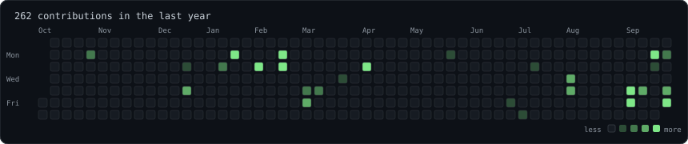

<code>mukand-mapara@github ~ $ ./contributions.sh</code>

  

 

<code>mukand-mapara@github ~ $ whoami</code>

  

<table>
  <tr>
    <td width="44%" align="center" valign="top">
      
    </td>

    <td width="56%" align="center" valign="top">
      
    </td>
  </tr>
</table>
